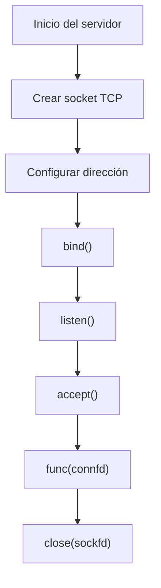
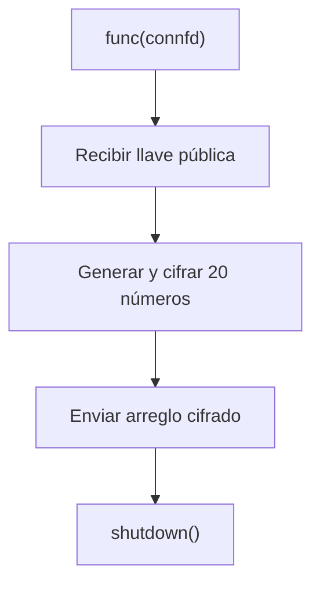
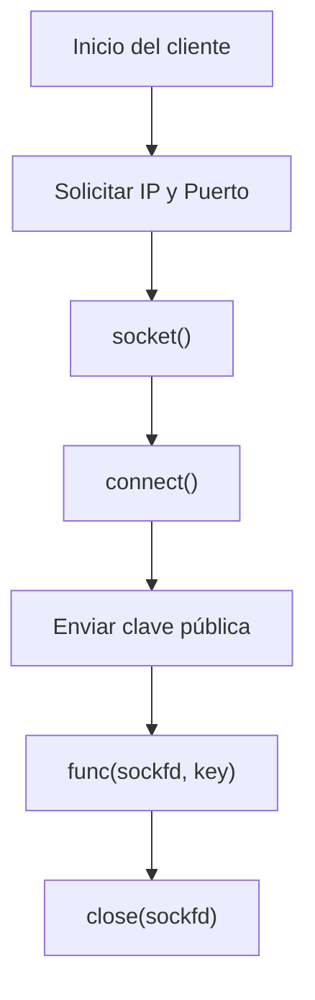

# Tcp-Client-Server-Network-Design
## Diseño de Infraestructura de Red y Comunicación Segura TCP


### Adriano Scatena

---

## Índice

- A. [Diseño de Topología y Subnetting (VLSM)](#diseño-de-topología-y-subnetting-vlsm)
    1. [Bloque de Red y Caracterización](#bloque-de-red-y-caracterización)
    2. [Definición de Subredes](#definición-de-subredes)
    3. [Asignación de Direcciones](#asignación-de-direcciones)
    4. [Enlaces Punto a Punto](#enlaces-punto-a-punto)
    5. [Tablas de Ruteo](#tablas-de-ruteo)
    6. [Implementación de NAT](#implementación-de-nat)

- B. [Arquitectura Cliente-Servidor TCP](#arquitectura-cliente-servidor-tcp)
    1. [Modelo General](#modelo-general)
    2. [Servidor](#servidor)
    3. [Cliente](#cliente)
    4. [Análisis de Tráfico de Red](#análisis-de-tráfico-de-red)
    5. [Modo de Uso](#modo-de-uso)

- C. [Archivo `topology.imn` – Definición de Topología en CORE](#archivo-topologyimn--definición-de-topología-en-core)
    1. [¿Qué es `topology.imn`?](#qué-es-topologyimn)
    2. [Estructura General del Archivo](#estructura-general-del-archivo)
    3. [Arquitectura Definida en el Archivo](#arquitectura-definida-en-el-archivo)
    4. [Funcionamiento Interno](#funcionamiento-interno)
    5. [Integración en CORE](#integración-en-core)
    6. [Rol del Archivo en el Proyecto](#rol-del-archivo-en-el-proyecto)

- D. [Bibliografía](#bibliografía)
 
---

# Diseño de Topología y Subnetting (VLSM)

## Bloque de Red y Caracterización

El diseño de la infraestructura parte del bloque:

```
181.29.188.0/22
```

En notación binaria:

```
10110101.00011101.10111100.00000000
  181   .  29    .  188   .  0
```

Por su prefijo binario `10`, corresponde a una red de **Clase B**, dentro del rango `128.x.x.x – 191.x.x.x`.

Con máscara `/22` (255.255.252.0) se dispone de:

\[
2^{10} - 2 = 1022 \text{ hosts}
\]

considerando la exclusión de dirección de red y broadcast.

El diseño se realiza utilizando **VLSM (Variable Length Subnet Masking)** con el objetivo de optimizar el uso del espacio de direccionamiento y evitar solapamientos.

---

## Definición de Subredes

Las subredes fueron dimensionadas según requerimientos de hosts, priorizando eficiencia y escalabilidad.

| Redes | Hosts requeridos | Subred Asignada | Rango |
|:------:|:----------------:|:---------------:|:------------------------------:|
| Red A | 230 | 181.29.188.0/24 | 181.29.188.0 – 181.29.188.255 |
| Red B | 500 | 181.29.190.0/23 | 181.29.190.0 – 181.29.191.255 |
| Red C | 40  | 181.29.189.0/26 | 181.29.189.0 – 181.29.189.63 |
| Red D | 64  | 181.29.189.128/25 | 181.29.189.128 – 181.29.189.255 |

La Red E corresponde al bloque privado `10.0.0.0/24`, perteneciente al rango definido por **RFC 1918**, reservado para direccionamiento interno.

---

## Asignación de Direcciones

Se definieron direcciones representativas para los nodos principales:

| Dispositivo | Red | Dirección |
|-------------|-----|-----------|
| n6  | Red A | 181.29.188.20/24 |
| n8  | Red B | 181.29.190.20/23 |
| n9  | Red C | 181.29.189.20/26 |
| n10 | Red D | 181.29.189.130/25 |
| n11 | Red E | 10.0.0.20/24 |

---

## Enlaces Punto a Punto

Para interconexión entre routers se utilizaron subredes `/30`, optimizadas para enlaces de dos hosts:

\[
2^2 = 4 \text{ direcciones} \Rightarrow 2 utilizables
\]

| Router | Conexión | Red |
|--------|----------|------|
| AEROESPACIAL | CENTRAL | 181.29.189.68/30 |
| AEROESPACIAL | HIDRÁULICA | 181.29.189.72/30 |
| HIDRÁULICA | CENTRAL | 181.29.189.76/30 |
| HIDRÁULICA | ELECTROTECNIA | 181.29.189.80/30 |
| ELECTROTECNIA | CENTRAL | 181.29.189.84/30 |
| ELECTROTECNIA | MECÁNICA | 181.29.189.88/30 |

---

## Tablas de Ruteo

El criterio de diseño del ruteo prioriza:

- Caminos más cortos.
- Uso preferencial del router Central cuando existen múltiples alternativas.
- Redundancia ante caída de enlaces.

(Se mantienen las tablas originales tal como fueron definidas en el diseño.)

---

## Implementación de NAT

Se implementa **Network Address Translation (NAT)** en el router Central.

Objetivos:

- Permitir salida a Internet desde la red privada `10.0.0.0/24`.
- Enmascarar direcciones privadas.
- Optimizar uso de direcciones públicas.

La configuración se realizó mediante reglas `iptables` en CORE Network Emulator, utilizando enmascaramiento dinámico.

---

# Arquitectura Cliente-Servidor TCP

## Modelo General

El sistema implementa una arquitectura TCP cliente-servidor en C que:

- Establece conexión confiable mediante TCP.
- Realiza intercambio de clave pública.
- Envía datos cifrados.
- Finaliza conexión ordenadamente.

Se utilizan las librerías:

- `<sys/socket.h>`
- `<netinet/in.h>`
- `<arpa/inet.h>`

---

## Servidor

El servidor:

1. Crea un socket TCP.
2. Asocia IP y puerto.
3. Escucha conexiones.
4. Acepta cliente.
5. Recibe clave pública.
6. Genera 20 números aleatorios (0–26).
7. Los cifra con:

\[
c = (x + key) \bmod 100
\]

8. Envía arreglo cifrado.
9. Finaliza con cierre ordenado.

### Diagrama de Flujo del Servidor



### Diagrama de Servicio Interno



---

## Cliente

El cliente:

1. Solicita IP y puerto al usuario.
2. Crea socket TCP.
3. Se conecta al servidor.
4. Envía clave pública.
5. Recibe arreglo cifrado.
6. Desencripta con:

\[
x = (c - key + 100) \bmod 100
\]

7. Imprime datos.
8. Cierra conexión ordenadamente.

### Diagrama de Flujo del Cliente



---

## Análisis de Tráfico de Red

Se realizó captura con Wireshark sobre la comunicación TCP.

### Establecimiento (3-Way Handshake)

1. SYN (cliente)
2. SYN-ACK (servidor)
3. ACK (cliente)

### Transmisión de Datos

- Paquetes con flag PSH.
- Confirmaciones ACK.
- Control de números SEQ y ACK.

### Terminación (4-Way Handshake)

1. FIN (servidor)
2. ACK (cliente)
3. FIN (cliente)
4. ACK (servidor)

Se verificaron correctamente:

- Sincronización inicial.
- Confirmaciones de recepción.
- Cierre ordenado.

---

## Modo de Uso

1. Abrir topología en CORE.
2. Compilar:

```bash
gcc servidor.c -o servidor
gcc cliente.c -o cliente
```

3. Ejecutar servidor.
4. Ejecutar cliente.
5. Ingresar IP y puerto del servidor.

---
---

# Archivo `topology.imn` – Definición de Topología en CORE

## ¿Qué es `topology.imn`?

El archivo `topology.imn` es el descriptor completo de la topología utilizada en CORE (Common Open Research Emulator).  

Se trata de un archivo en formato declarativo que:

- Define nodos (routers, PCs).
- Configura interfaces y direcciones IP.
- Establece enlaces físicos.
- Asigna servicios (NAT, IPForward, StaticRoute, DefaultRoute).
- Incluye scripts personalizados de configuración.
- Representa visualmente las redes y segmentos.

En otras palabras, este archivo es la representación integral de la arquitectura de red implementada en el proyecto.

---

## Estructura General del Archivo

El archivo se organiza en bloques principales:

### 1. `node`

Define cada dispositivo de la topología.

Ejemplo conceptual:

```
node n1 {
    type router
    model router
    network-config {
        hostname CENTRAL
        interface eth0
            ip address 163.10.11.2/30
    }
}
```

Cada nodo incluye:

- Tipo (router / PC).
- Hostname.
- Interfaces.
- Direccionamiento IPv4 / IPv6.
- Servicios habilitados.
- Scripts personalizados.

---

### 2. `link`

Define conexiones punto a punto entre nodos.

Ejemplo:

```
link l1 {
    nodes {n2 n1}
}
```

Cada enlace representa un cable virtual dentro del entorno CORE.

---

### 3. `custom-config`

Permite ejecutar scripts automáticamente al iniciar la topología.

En este proyecto se utilizan principalmente:

- `nat.sh`
- `staticroute.sh`
- `defaultroute.sh`

Estos scripts configuran:

- NAT mediante iptables.
- Rutas estáticas.
- Rutas por defecto.
- Métricas para priorización de caminos.

---

## Arquitectura Definida en el Archivo

La topología implementa:

- 5 routers principales:
  - CENTRAL
  - AEROESPACIAL
  - HIDRAULICA
  - ELECTROTECNIA
  - MECANICA

- 4 hosts finales:
  - n6 (Red A)
  - n8 (Red B)
  - n9 (Red C)
  - n10 (Red D)

- 1 host en red privada:
  - n11 (Red E – 10.0.0.0/24)

- 1 nodo ISP simulado.

Se implementa:

- Subnetting VLSM.
- Enlaces /30 punto a punto.
- Ruteo estático con métricas.
- NAT dinámico (masquerade).
- IPv4 e IPv6 coexistentes en algunos enlaces.

---

## Funcionamiento Interno

Al iniciar la topología en CORE:

1. Se crean los namespaces Linux correspondientes a cada nodo.
2. Se levantan las interfaces virtuales.
3. Se asignan direcciones IP.
4. Se ejecutan automáticamente los servicios definidos:
   - IPForward
   - StaticRoute
   - DefaultRoute
   - NAT
5. Se ejecutan los scripts personalizados incluidos en `custom-config`.

### NAT en el Router CENTRAL

El script `nat.sh` ejecuta:

```
iptables -t nat -A POSTROUTING -s 10.0.0.0/24 -o eth0 -j MASQUERADE
iptables -A FORWARD -i eth4 -o eth0 -s 10.0.0.0/24 -j ACCEPT
iptables -A FORWARD -i eth0 -o eth4 -d 10.0.0.0/24 -j ACCEPT
```

Esto permite:

- Traducción de direcciones privadas a públicas.
- Acceso al ISP desde la red 10.0.0.0/24.
- Comunicación bidireccional controlada.

---

## Integración en CORE

### Método 1 – Apertura Directa

1. Abrir CORE.
2. Seleccionar **File → Open**.
3. Cargar `topology.imn`.
4. Presionar **Start** para iniciar la emulación.

CORE automáticamente:

- Genera todos los nodos.
- Crea enlaces.
- Ejecuta scripts.
- Aplica ruteo.

---

### Método 2 – Desde Línea de Comando

Si se desea iniciar desde terminal:

```
core-gui topology.imn
```

o en versiones más recientes:

```
core topology.imn
```

---

## Rol del Archivo en el Proyecto

`topology.imn` es la materialización de la arquitectura de red diseñada.

Define:

- Estructura lógica.
- Conectividad física virtual.
- Políticas de ruteo.
- Política de traducción de direcciones.
- Segmentación por subredes.

Esta topología constituye el entorno de ejecución sobre el cual se despliega y analiza el sistema cliente-servidor TCP implementado en el proyecto.
---
# Bibliografía

1. Manual de sockets en C — Universidad de Cantabria  
2. TCP Server-Client implementation in C — GeeksforGeeks  
3. Manual recv() — linux.die.net  
4. Manual send() — linux.die.net
