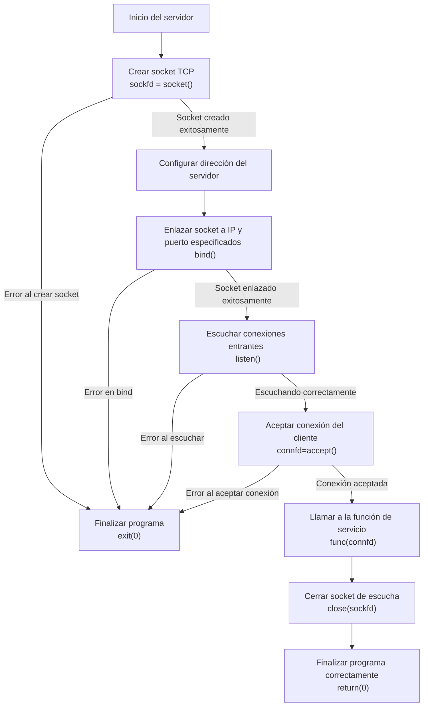
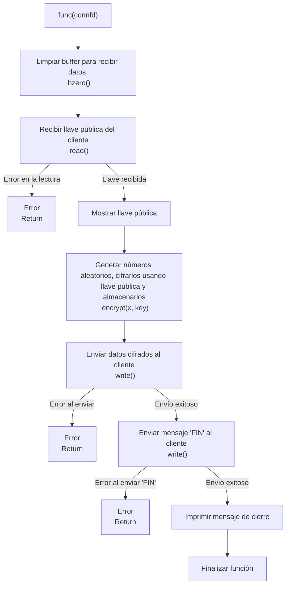
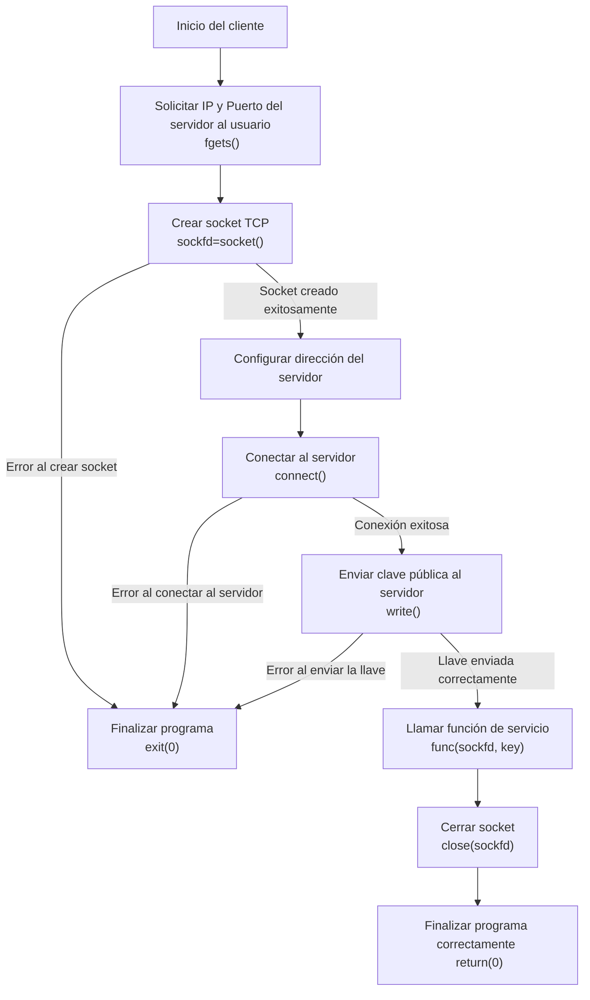
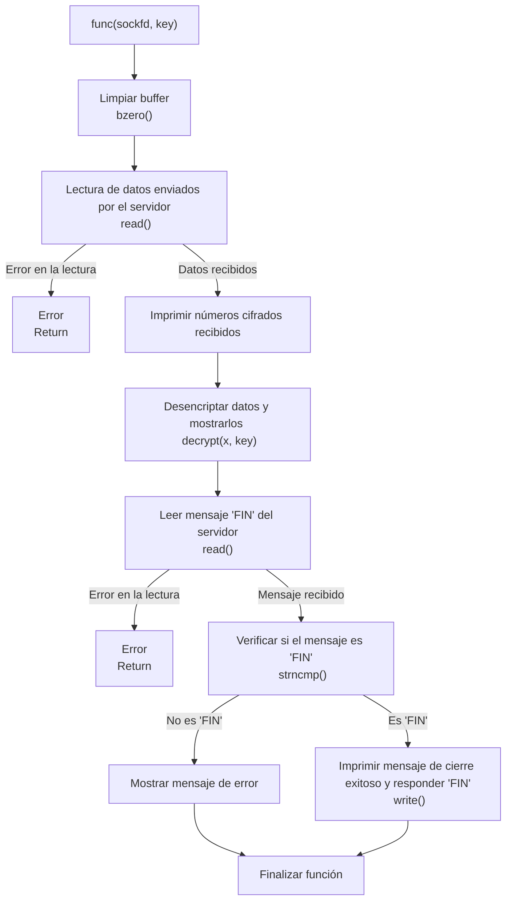

# Entregable Practica 4

### Scatena, Adriano 74725/9

### Rolandelli, Lautaro 74366/5

## Indice
- A. [Ejercicio 23](#ejercicio-23)
    1. [Consigna](#consigna)
    2. [Resolución](#resolución)
    3. [Tablas de ruteo](#tablas-de-ruteo)
    4. [NAT](#nat)

- B. [Ejercicio 31](#ejercicio-31) 
    1. [Consigna](#consigna-1)
    2. [Resolución](#resolución-1)
    3. [Servidor](#servidor)
    4. [Cliente](#cliente)
    5. [Análisis de tráfico de red](#análisis-de-tráfico-de-red)
    6. [Modo de uso](#modo-de-uso)

- C. [Bibliografía](#bibliografía)
# Ejercicio 23
## Consigna
Dado el bloque de red asignado (en este caso 181.29.188.0/22) y la topología `entregable.imn` brindada por la cátedra, cada grupo deberá:
1. Identifique la clase a la que corresponde el segmento asignado.
2. Determine la cantidad de host que puede direccionar si utiliza todo el
segmento.
1. Realizar la asignación de direcciones para cada dispositivo.
2. Realizar el ruteo necesario para llegar a cualquier segmento de la topología
(incluso a internet). Opcional: Sumarizar las rutas.
1. ¿Dónde aplicaría NAT? ¿Por qué?. Opcional: Implemente sobre la topología.
2. Opcional: Modificar el MTU para probar la fragmentación. Debe capturar el
tráfico y analizarlo.
1. Compruebe el correcto direccionamiento utilizando los comandos ping y/o
traceroute.

**Consideraciones:**
- Realizar el subnetting y tener en cuenta los enlaces punto a punto.
- Requerimientos de hosts por red:
  - Red A: 230 hosts.
  - Red B: 500 hosts.
  - Red C: 40 hosts.
  - Red D: 64 hosts.
- Considerar caminos alternativos en caso de caída de un enlace.

## Resolución
### Determinaciones iniciales
El segmento asignado al Grupo 1 es: 
`181.29.188.0/22`. A partir del mismo, se determina la clase a la cual pertenece el segmento, observese la notación en binario del Quad-Dot a continuación:

```
10110101.00011101.10111100.00000000
  181   .  29    .  188   .  0
```
A partir de la misma, se puede observar que el segmento corresponde a la **Clase B**, iniciado con 10 en binario y encontrándose en el rango definido para la misma desde `128.x.x.x` a `191.x.x.x`.

En caso de utilizarse todo el segmento, podrían direccionarse $2^{10}-2=1022$ hosts, ya que se corresponde con la cantidad de bits destinados al direccionamiento de los mismos, a patir de la máscara designada /22 (es decir 255.255.252.0). Se le restan 2 direcciones teniendo en cuenta que por convención, la dirección de host 0 (todos los bits de host en 0) corresponde a la dirección de Red y la correspondiente a todos los bits de host en 1 se reserva para *broadcast*.

A partir de los requisitos explicitados para cada red, se realizó el *subnetting* correspondiente, verificando que no exista solapamiento en las direcciones IP implementadas, así como preservando de la manera más eficiente posible la cantidad de host direccionables por la subred y la cantidad de host requeridos por la misma. Partiendo de la dirección del bloque asignado, se aplicaron máscaras variables sobre la dirección asignada, en pos de controlar la cantidad de sistemas direccionables, y se modificaron bits de la asignación de red para evitar solapamiento. Expandiendo este procedimiento se obtiene la asignación vista en la siguiente tabla, junto con el rango de direccionamiento de cada subred (correspondiente a la direccion de red  a la dirección de *broadcast* de cada una).

### Definicion de cada Red propuesta
|  Redes  | Hosts requeridos |  Subred Asignada | Rango |
|:-------:|:-----:|:---------------:|:---------------:|
| Red A   |  230  | 181.29.188.0/24 | 181.29.188.0 - 181.29.188.255 |
| Red B   |  500  | 181.29.190.0/23 | 181.29.190.0 - 181.29.191.255 |
| Red C   |  40   | 181.29.189.0/26 | 181.29.189.0 - 181.29.189.63 |
| Red D   |  64   | 181.29.189.128/25 | 181.29.189.128 - 181.29.189.255 |

Cabe destacar que la Red E, predefinida en la topología entregada por la cátedra, se trata de una dirección *IP Privada*, de tipo **Clase A**, perteneciente al rango reservado definidos por la *RFC 1918* para la clase A, que va desde 10.0.0.0 hasta 10.255.255.255 (Clase A) y se supone su número de hosts como los máximos disponibles. Esta red será de particular interés en el apartado destinado a la temática de NAT.

### Asignación de direcciones para cada dispositivo.
<table>
  <tr>
    <th colspan="5" style="text-align: center;">Direcciones de los dispositivos</th>
  </tr>
  <tr>
    <th>Dispositivo</th>
    <th>Red</th>
    <th>Dirección designada</th>
  </tr>
  <tr>
    <td>n6</td>
    <td>Red A</td>
    <td>181.29.188.20/24</td>
  </tr>
    <tr>
    <td>n8</td>
    <td>Red B</td>
    <td>181.29.190.20/23</td>
  </tr>
    <tr>
    <td>n9</td>
    <td>Red C</td>
    <td>181.29.189.20/26</td>
  </tr>
  <tr>
    <td>n10</td>
    <td>Red D</td>
    <td>181.29.189.130/25</td>
  </tr>
  <tr>
    <td>n11</td>
    <td>Red E</td>
    <td>10.0.0.20/24</td>
  </tr>
</table>

Por convención, se designaron a todos los dispositivos pertenecientes a cada red como el host número 20 de la misma, a excepción del *n10*, que se designa como el primer host direccionable de su subred, siendo que a misma comienza en 128 en el último octal. 


### Enlaces Punto a Punto (P2P)
Para la selección de los enlaces internos entre *routers*, se eligió configurar todas las conexiones otorgando una subred diferente por cada enlace. La máscara elegida fue /30, ya que era necesario e direccionamiento de solo 2 sistemas. Con esta máscara, se tienen disponibles cuatro hosts ($2² = 4$), siendo dos reservados para red y broadcast respectivamente, resultando los dos restantes uno para cada router.

<table>
  <tr>
    <th colspan="5" style="text-align: center;">Enlaces punto a punto</th>
  </tr>
  <tr>
    <th>Router</th>
    <th>Conexión con</th>
    <th>Red Designada</th>
  </tr>
  <tr>
    <td>AEROESPACIAL</td>
    <td>CENTRAL</td>
    <td>181.29.189.68/30 </td>
  </tr> 
  <tr>
    <td>AEROESPACIAL</td>
    <td>HIDRÁULICA</td>
    <td>181.29.189.72/30 </td>
  </tr> 
  <tr>
    <td>HIDRÁULICA</td>
    <td>CENTRAL</td>
    <td>181.29.189.76/30 </td>
  </tr>
  <tr>
    <td>HIDRÁULICA</td>
    <td>ELECTROTECNIA</td>
    <td>181.29.189.80/30 </td>
  </tr>
  <tr>
    <td>ELECTROTECNIA</td>
    <td>CENTRAL</td>
    <td>181.29.189.84/30 </td>
  </tr>
  <tr>
    <td>ELECTROTECNIA</td>
    <td>MECÁNICA</td>
    <td>181.29.189.88/30 </td>
  </tr>
</table>

### Tablas de Ruteo

Se destaca que el criterio de seleccion de metricas para otorgarle prioridad a ciertos caminos fue tomado en base a cual es el camino mas corto para llegar a destino. En caso de tener caminos de igual recorrido, se opta por seleccionar que los ruteos pasen por el Central preferentemente, como prioridad. 
A continuación, en las siguientes tablas puede observarse una representación del diseño de las tablas de ruteo para el bloque de red.

<table>
  <tr>
    <th colspan="5" style="text-align: center;">Router Hidráulica</th>
  </tr>
  <tr>
    <th>Destino</th>
    <th>Máscara</th>
    <th>Pasarela</th>
    <th>Métrica</th>
  </tr>
  <tr>
    <td>Red A</td>
    <td>/24</td>
    <td>Hidráulica</td>
    <td>0</td>
  </tr>
  <tr>
    <td>Red B</td>
    <td>/23</td>
    <td>Electrotecnia</td>
    <td>0</td>
  </tr>
    <tr>
    <td>Red B</td>
    <td>/23</td>
    <td>Central</td>
    <td>10</td>
  </tr>
    <tr>
    <td>Red B</td>
    <td>/23</td>
    <td>Aeroespacial</td>
    <td>20</td>
  </tr>
    <tr>
    <td>Red C</td>
    <td>/26</td>
    <td>Electrotecnia</td>
    <td>0</td>
  </tr>
    <tr>
    <td>Red C</td>
    <td>/26</td>
    <td>Central</td>
    <td>10</td>
  </tr>
    <tr>
    <td>Red C</td>
    <td>/26</td>
    <td>Aeroespacial</td>
    <td>20</td>
  </tr>
  <tr>
    <td>Red D</td>
    <td>/25</td>
    <td>Aeroespacial</td>
    <td>0</td>
  </tr>
    <tr>
    <td>Red D</td>
    <td>/25</td>
    <td>Central</td>
    <td>10</td>
  </tr>
    <tr>
    <td>Red D</td>
    <td>/25</td>
    <td>Electrotecnia</td>
    <td>20</td>
  </tr>
</table>
<table>
  <tr>
    <th colspan="5" style="text-align: center;">Router Aeroespacial</th>
  </tr>
  <tr>
    <th>Destino</th>
    <th>Máscara</th>
    <th>Pasarela</th>
    <th>Métrica</th>
  </tr>
  <tr>
    <td>Red A</td>
    <td>/24</td>
    <td>Hidráulica</td>
    <td>0</td>
  </tr>
    <tr>
    <td>Red A</td>
    <td>/24</td>
    <td>Central</td>
    <td>10</td>
  </tr>
    <tr>
    <td>Red B</td>
    <td>/23</td>
    <td>Central</td>
    <td>0</td>
  </tr>
  <tr>
    <td>Red B</td>
    <td>/23</td>
    <td>Hidráulica</td>
    <td>10</td>
  </tr>
    <tr>
    <td>Red C</td>
    <td>/26</td>
    <td>Central</td>
    <td>0</td>
  </tr>
    <tr>
    <td>Red C</td>
    <td>/26</td>
    <td>Hidráulica</td>
    <td>10</td>
  </tr>
  <tr>
    <td>Red D</td>
    <td>/25</td>
    <td>Aeroespacial</td>
    <td>0</td>
  </tr>
</table>

<table>
  <tr>
    <th colspan="5" style="text-align: center;">Router Electrotecnia</th>
  </tr>
  <tr>
    <th>Destino</th>
    <th>Máscara</th>
    <th>Pasarela</th>
    <th>Métrica</th>
  </tr>
  <tr>
    <td>Red A</td>
    <td>/24</td>
    <td>Hidráulica</td>
    <td>0</td>
  </tr>
  <tr>
    <td>Red A</td>
    <td>/24</td>
    <td>Central</td>
    <td>10</td>
  </tr>
    <tr>
    <td>Red B</td>
    <td>/23</td>
    <td>Aeroespacial</td>
    <td>0</td>
  </tr>
    <tr>
    <td>Red C</td>
    <td>/26</td>
    <td>Mecánica</td>
    <td>0</td>
  </tr>
  <tr>
    <td>Red D</td>
    <td>/25</td>
    <td>Central</td>
    <td>0</td>
  </tr>
    <tr>
    <td>Red D</td>
    <td>/25</td>
    <td>Hidráulica</td>
    <td>10</td>
  </tr>
</table>

<table>
  <tr>
    <th colspan="5" style="text-align: center;">Router Mecánica</th>
  </tr>
  <tr>
    <th>Destino</th>
    <th>Máscara</th>
    <th>Pasarela</th>
    <th>Métrica</th>
  </tr>
  <tr>
    <td>Red A</td>
    <td>/24</td>
    <td>Electrotecnia</td>
    <td>0</td>
  </tr>
    <tr>
    <td>Red B</td>
    <td>/23</td>
    <td>Electrotecnia</td>
    <td>0</td>
  </tr>
    <tr>
    <td>Red C</td>
    <td>/26</td>
    <td>Mecánica</td>
    <td>0</td>
  </tr>
    <tr>
    <td>Red D</td>
    <td>/25</td>
    <td>Electrotecnia</td>
    <td>0</td>
  </tr>
</table>

<table>
  <tr>
    <th colspan="5" style="text-align: center;">Router Central</th>
  </tr>
  <tr>
    <th>Destino</th>
    <th>Máscara</th>
    <th>Pasarela</th>
    <th>Métrica</th>
  </tr>
  <tr>
    <td>Red A</td>
    <td>/24</td>
    <td>Hidráulica</td>
    <td>0</td>
  </tr>
  <tr>
    <td>Red A</td>
    <td>/24</td>
    <td>Electrotecnia</td>
    <td>10</td>
  </tr>
    <tr>
    <td>Red A</td>
    <td>/24</td>
    <td>Aeroespacial</td>
    <td>20</td>
  </tr>
    <tr>
    <td>Red B</td>
    <td>/23</td>
    <td>Electrotecnia</td>
    <td>0</td>
  </tr>
    <tr>
    <td>Red B</td>
    <td>/23</td>
    <td>Hidráulica</td>
    <td>10</td>
  </tr>
    <tr>
    <td>Red B</td>
    <td>/23</td>
    <td>Aeroespacial</td>
    <td>20</td>
  </tr>
    <tr>
    <td>Red C</td>
    <td>/26</td>
    <td>Electrotecnia</td>
    <td>0</td>
  </tr>
  <tr>
    <td>Red C</td>
    <td>/26</td>
    <td>Hidráulica</td>
    <td>10</td>
  </tr>
    <tr>
    <td>Red C</td>
    <td>/26</td>
    <td>Aeroespacial</td>
    <td>20</td>
  </tr>
    <tr>
    <td>Red D</td>
    <td>/25</td>
    <td>Aeroespacial</td>
    <td>0</td>
  </tr>
    <tr>
    <td>Red D</td>
    <td>/25</td>
    <td>Hidráulica</td>
    <td>0</td>
  </tr>
    <tr>
    <td>Red D</td>
    <td>/25</td>
    <td>Electrotecnia</td>
    <td>10</td>
  </tr>
    <tr>
    <td>Red E</td>
    <td>/24</td>
    <td>Central</td>
    <td>0</td>
  </tr>
</table>

### NAT 
La NAT (**Network Address Translation**) es un servicio o proceso de traducción de direcciones IP y puertos. Permite cambiar las direcciones IP en los paquetes de red en el momento que atraviesan un router o *firewall*. El objetivo principal de esta traducción de direcciones es reducir la necesidad de direcciones públicas IPv4 y, en términos de seguridad, "esconder" los rangos de direcciones privadas de red. Logra lo primero reduciendo el uso de direcciones IP privadas(que escasean), por que permite que varios dispositivos en una red privada sean *enmascarados* bajo una sola IP pública. El funcionamiento básico del proceso de traducción ejecutado en un router se basa principalmente en asignar una dirección IP pública compartida a varios dispositivos privados o uno en específico. Luego, cuando un dispositivo interno inicia una conexión hacia el exterior, el router mismo reemplaza la dirección IP privada por la dirección IP pública, y dicho enmascaramiento lo registra en una tabla de NAT. Al llegar una respuesta, el router consulta la misma tabla de NAT para reenviar el paquete al dispositivo correcto que inicio la comunicación dentro de la red privada.
De esta manera, es sencillo observar que el servicio de NAT debe apicarse en el router **Central**, ya que es el router de enlace de la red privada 10.0.0.0/24, con las direcciones públicas, entre ellas el ISP. Es por ello que, mediante el uso del comando ```iptable``` se configura la tabla NAT del Central de manera tal que aplique un enmascaramiento de la dirección privada de la Red E cuando la misma inicie un trafico de datos hacia Internet mediante el ISP. Se utilizó el servicio NAT propio de la ventana de servicios de CORE Network Emulator para declarar los comandos a ejecutar para configurar el proceso.


# Ejercicio 31
## Consigna

1. Implementar un **cliente TCP** que cumpla las siguientes características:
   - a) Reciba números del 0 al 26 y los imprima en la salida estándar.
     1. Debe permitir al usuario especificar la IP y el puerto al que desea conectarse.  
        *(Ayuda: tener cuidado con los formatos utilizados. Útil: `netinet/in.h`, `arpa/inet.h`).*
     2. Debe desencriptar los datos antes de imprimir. Para esto, el cliente dispondrá de las llaves pública y privada, y antes de comenzar el intercambio deberá enviar la llave pública al servidor.
     3. El cliente puede ejecutarse en un host a elección.
     4. El cliente finaliza cuando recibe un **FIN** del servidor y deberá responder con un **FIN**.

2. Implementar un **servicio TCP** que cumpla las siguientes características:
   - b) Envíe números del 0 al 26.
     1. Debe permitir conexiones desde un host remoto (ejemplo: `n9`).
     2. Los datos deben cifrarse antes de ser enviados, para lo cual el servidor utilizará la llave pública que recibió del cliente.
     3. Luego de enviar los datos, debe finalizar de manera ordenada enviando un **FIN** al cliente.
     4. El servicio puede ejecutarse en un host a elección diferente al cliente.

3. Capturar tráfico y analizar los paquetes intercambiados:
   - c) Analizar:
     - Datos.
     - Flags.
     - Seq.
     - Ack.
     - Otros detalles relevantes.

## Resolución

Para la solución del problema planteado en el ejercicio se generaron dos scripts en lenguaje C que determinan el comportamiento adecuado tanto para el cliente como para el servidor y su servicio asociado, utilizando el protocolo de transporte TCP para la comunicación entre ambas partes. De particular utilización son las funciones presentes en las librerías  
`<sys/socket.h>` y `<netinet/in.h>`
`<arpa/inet.h>`. En la primera se encuentran tanto funciones como estructuras necesarias para trabajar con sockets, tales como `socket()`, `bind()`,` listen()`, `connect()`, `close()`, entre otras, que son utilizadas para generar la apertura y configuración del socket asociado al servicio, así como tambien administrar la conexión con el cliente. En las librerias restantes se encuentran las estructuras y funciones que permiten trabajar con puertos, direcciones IP y la conversión entre estas últimas expresadas en cadenas en Quad-Dot y las mismas direcciones en binario. Tanto `struct sockaddr_in`, `htons()`, `htonl()`, `inet_aton()` se encuentran en estas bibliotecas.

## Servidor

La implementación del servidor TCP diseñado tiene como objetivo recibir una clave pública desde un cliente, generar 20 números aleatorios, cifrarlos utilizando dicha clave, y enviarlos de vuelta al cliente. Dentro del proceso del mismo, se administra la creación del socket TCP, su correlación con una dirección IP y un puerto, y el procedimiento protocolar TCP de conexión con el cliente. También se administra la ordenada finalización de la conexión. En pos de conseguir un código más limpio, estrucuturado y fácil de interpretar, se estableció la rutina de configuración de conexión dentro del flujo principal, y el servicio específico dentro de una función declarada (`func()`) a la cual se la llama dentro de este flujo.

En el inicio, se declaran las variables y estructuras de control de conexión y de configuración del propio *server*, como el descriptor del socket `sockfd` y las estructuras del cliente y servidor definidas como `sockaddr_in`. Esta estructura tiene especial importancia ya que contiene los datos de funcionamiento del servidor:
```C
struct sockaddr_in {
    short sin_family; // Define la familia de direcciones IP a esperar, en caso IPv4 se usa AF_INET
    unsigned short sin_port; // Define el port (en orden de bytes de la red, por lo que se usa htons() para pasar de fomato de Host a formato de Red) 
    struct in_addr sin_addr; // Esta estructura define la direccion IP del socket (se escribe en 32 bits por o que se usa inet_aton() para conversión)
    char sin_zero[8]; // Definido pero no se usa
    };
```
Mediante la función `socket()` se crea el socket, explicitando `AF_INET` para familia de direcciones IPv4, `SOCK_STREAM` para indicar el uso de datos TCP, y el $0$ final indica al SO que seleccione el protocolo adecuado.
```C
  sockfd = socket(AF_INET, SOCK_STREAM, 0);
```
Luego se asigna tanto la IP como el puerto a utilizar por el servidor, completando los campos de la estructura antes mencionada. Se utiiza la bandera `INADDR_ANY` para que acepte conexiones en cualquier interfaz de red disponible.
```C
    servaddr.sin_family = AF_INET;  
    servaddr.sin_addr.s_addr = htonl(INADDR_ANY);  
    servaddr.sin_port = htons(PORT);  
```
Creado el socket TCP se lo asocia con los datos de la estructura, es decir la dirección IP y puerto especificados, mediante `bind()`. Como `bind()` se puede usar con otras familias, es necesario hacer una conversión de tipo (cast) entre `sockaddr_in` y `sockaddr`.
Posteriormente, se pasa el socket a un estado de apertura pasiva con `listen()`, donde espera por conexiones entrantes. Una vez que un cliente se conecta, la función `accept()` establece la conexión y permite el intercambio de datos.

El flujo del servicio comienza con el servidor recibiendo la clave pública del cliente, la cual se procesa y almacena para usar en el cifrado. Esto se hace mediante la función `recv()`, la cual lee los datos del descriptor de archivos *connected* del socket, y los almacena dentro de `buffer`, que es un arreglo de caractéres. A continuación, el servidor genera 20 números aleatorios entre 0 y 26, los cifra con una operación modular (especificada en la función de usuario `encrypt()`), basada en la clave pública recibida, y los almacena en un arreglo. Este arreglo cifrado es enviado al cliente mediante la función `send()`, la cual a la inversa de `recv()`, copia lo almacenado en el *buffer* de datos encriptados (en este caso `num_array`) en el descriptor del socket. Finalmente, el servidor envía la flag de cierre (*FIN*) al cliente, utilizando al función `shutdown()`, cerrando el descriptor para la escritura y lectura de datos con la bandera `SHUT_WR`, y cierra la conexión de manera ordenada usando `close()`.

Cabe destacar que se implementó un manejo básico de errores con tal de asegurar que el servidor informe ante fallos comunes como problemas al crear el socket, errores de enlace o fallas de comunicación.

### Diagramas de flujo
En el siguiente diagrama puede observarse la rutina de ejecución del servidor.

Para especificar su funcionamiento, se adjunta a continuación el diagrama de flujo de la función que realiza el servicio propiamente dicho.


## Cliente
Para el cliente, se generó un script en C que se encarga de describir el funcionamiento del mismo, con el objetivo de que el cliente se conecte al servidor implementado, acudiendo a establecer una conexión TCP para recibir y desencriptar el paquete de números enviados de manera cifrada por el servidor. Previamente a la recepción de los datos, el cliente informa la clave pública mediante la cual serán encriptados los datos por el servidor. Nuevamente se estrucutura la rutina de configuración de conexión dentro del flujo principal, y comportamiento específico del cliente dentro de (`func()`) a la cual se la llama dentro del flujo principal.
Respetando los requisitos de la consigna, en primer lugar, el cliente solicita al usuario la IP y el puerto del servidor al que desea conectarse. Luego, se procede a crear un socket TCP de manera totalmente análga a como se realiza en el servidor, usando `socket()`, explicitand el protocolo `AF_INET` para IPv4 y el tipo `SOCK_STREAM` para establecer una conexión orientada a TCP. Tras crear el socket, se repite el mismo proceso que en la contraparte, donde se configura la dirección del servidor (utlizando la IP y el puerto provistos por el usuario) usando la estructura `sockaddr_in` ya comentada. Para la conexión con el servidor se reutiliza la función `connect()`. Una vez exitosa la conexión, el cliente comunica en formato de cadena la clave pública mediante el uso de `send()` y el descriptor de archivos del socket (`sockfd`).

Posteriormente, el cliente entra en su función específica, en donde recibe el arreglo de 20 números cifrados enviados por el servidor a través del uso de `recv()` y `sockfd`, copiando lo recibido en `buffer`. Estos datos deben ser desencriptados, y se hace usando una función de desencriptación (`decrypt()`), que aplica módulo 100 a la operación $x - clave +100$, donde $x$ es el dato a desencriptar. Tanto los números cifrados como los resultantes de la desencriptación se imprimen en la terminal a modo de control. Toda esta dinámica está implementada dentro de un bucle que controla lo devuelto por `recv()`, ya que se espera qe el servidor enví la flag *FIN* respectiva para el cierre de la conexión, siendo 0 el valor de retorno cuando `recv()` recibe dicho paquete. Ya recibidos los datos, el cliente debe manejar el cierre de la comunicación. Después de recibir el mensaje *FIN* del servidor, el cliente responde enviando *FIN* de vuelta al servidor (dinámica ya incuida en el propio protocolo TCP), lo que indica el cierre de la conexión. Finalmente, el socket se cierra con la función `close()`.

### Diagramas de flujo
En primer lugar, se visualiza a continuación el diagrama de flujo correspondiente a la rutina del cliente.


Además, se profundiza el diagrama con la explicación de las tareas de la función en la cual se realiza el servicio específico entre servidor y cliente.


## Análisis de tráfico de Red

### Análisis de la Conexión TCP entre el Cliente y el Servidor

Se realiza la captura de datos de la conexión TCP entre el servidor 181.29.189.130 (perteneciente a la subred D) y el cliente 181.29.189.20 (perteneciente a la subred C). A continuación, se pueden observar los diferentes paquetes que se intercambiaron durante el establecimiento de la conexión, la transmisión de datos y la terminación de la conexión. El de inicio de la conexión TCP comienza con el *three-way handshake* (caracteristica del protocolo TCP), que permite una comunicación confiable (a diferencia de UDP), asegurando que ambas máquinas estén sincronizadas antes de empezar a compartir información. Véase la siguiente figura con el tráfico de datos TCP capturado.


A modo de argumentar los envíos de flags de control vistos en el tráfico de red, nos basamos en los esquemas de *3-way handshake* y *4-way handshake* presentados en la teoría, cistos respectivamente a continuación.


#### Establecimiento de la Conexión:

El cliente inicia la conexión enviando el flag *SYN* en el paquete 8, comunicando su intención de establecer una conexión, con el número de secuencia $SEQ_{cliente} = 0$. El servidor, al recibir este paquete, responde con el paquete 9 *SYN, ACK*, confirmando la recepción del *SYN* del cliente con *ACK* con número $SEQ_{cliente} + 1=1$ y también enviando su propio *SYN* con sequencia $SEQ_{server} = 0$. Este paso es conocido como el proceso de sincronización de la conexión. Finalmente, el cliente envía un paquete *ACK* en el paquete 10 para confirmar la recepción del *SYN, ACK* del servidor, con el número $SEQ_{servidor} + 1$ completando así el establecimiento de la conexión TCP. En este punto, la conexión está establecida y ambos extremos pueden comenzar a intercambiar datos.

#### Transmisión de Datos:

Una vez establecida la conexión, se llevan a cabo varias transmisiones de datos. Los paquetes son enviados con el flag *PSH* indicando la  instrucción de *"empujar"* los datos hacia la aplicación sin esperar más datos del flujo TCP. Generalmente útil si la aplicación o cliente necesita los datos rapidamente. Además de los paquetes de datos, se observa el recibo *ACK* para confirmar la recepción de los mismos.

#### Terminación de la Conexión:

La finalización de la conexión TCP se lleva a cabo mediante el proceso del *4-way handshake*, que asegura que ambas partes de la conexión terminen la comunicación de manera ordenada. Este comienza cuando el servidor envía el paquete (No. 14) con la flag *FIN* con $SEQ_{server}=81$, indicando que ha terminado de enviar datos y desea cerrar la conexión. Al recibir este paquete, el cliente responde con un *ACK*, cuyo número es $SEQ_{server}+1=82$ en el paquete No. 15, para confirmar la recepción del *FIN* previo. Luego, el cliente también envía su propio *FIN* con la secuencia $SEQ_{client} = 11$ para indicar que ya no tiene más datos que enviar, y el servidor, a su vez, responde con un *ACK* consecuente a la secuencia del cliente, es decir $SEQ_{client} + 1 =12$, confirmando la recepción del *FIN* del mismo. Este intercambio de control asegura que ambas partes cierren la conexión de manera segura. 

## Modo de uso

Para hacer uso y depurar/comprobar la funcionalidad del cliente y servidor implementados, debe seguirse los siguientes pasos.
Inicialmente debe abrirse la topología implementada en `e23.imn` en el software ***CORE Network Emulator***, de manera que pueda posteriormente iniciarse la sesión de red donde se trabajará con las entidades implementadas. Previamente o en la propia consola del sistema a tomar como servidor (o cliente), debe compilarse el script en lenguaje C a accionar. Esto puede hacerse via consola con el comando:
```bash
  gcc <archivo.c> -o <archivo_ejecutable>
```
Esto debe realizarse tanto para el script `cliente.c` como `servidor.c`, de lo contrario no podran ejecutarse.
Una vez compilado, se debe ingresar a la consola del sistema al que se quiere accionar como servidor y ejecutar en él el archivo ejecutable compilado previamente. Es importante primero ejecutar el servidor en un sistema y luego el cliente, de lo contrario no se establecerá conexión alguna. La ejecución en terminal se realiza como:
```bash
  ./<archivo_ejecutable>
```
Es de utilidad el comando `cd` para poder cambiar de directorio a donde se haya ubicado los archivos ejecutables.
Una vez ejecutado, en el servidor, se informará la correcta conexión o agún error en la misma en caso que corresponda, y solo se procederá al servicio si se conecta un cliente. En el caso del cliente, ejecutado el programa deberá informarse el número de puerto y la dirección IP del servidor, información accesible tanto en la topología de CORE (en caso de la IP), como en la terminal del servidor (en caso del puerto). Proporcionado los datos se podrá observar la funcionalidad del esquema cliente-servidor reaizado.

# Bibliografía
1. ["Manual de sockets en C.", Universidad de Cantabria.](https://ocw.unican.es/pluginfile.php/2343/course/section/2300/PIR-Practica4_ManualSocketsC.pdf) Consultado en línea 2024-12-05.

2. ["TCP Server-Client implementation in C."](https://www.geeksforgeeks.org/tcp-server-client-implementation-in-c/) Consultado en línea 2024-12-05.

3. ["Manual de la función recv()"](https://linux.die.net/man/2/recv) 

4. ["Manual de la función send()"](https://linux.die.net/man/2/send)
