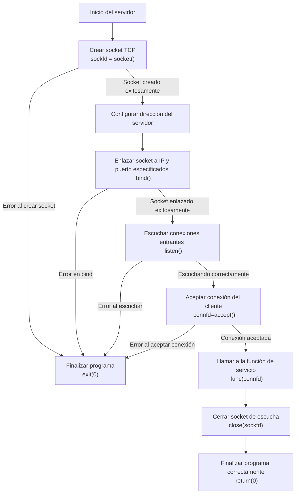
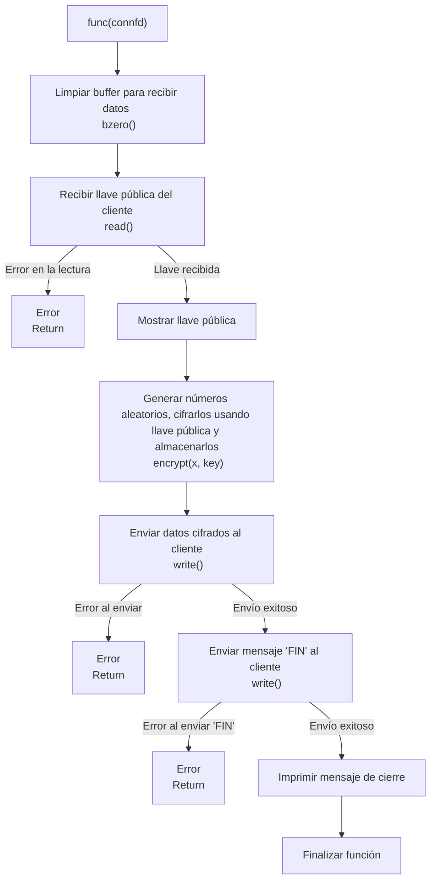
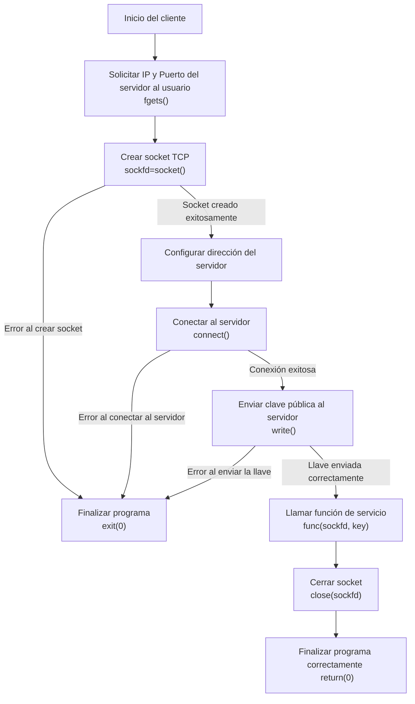
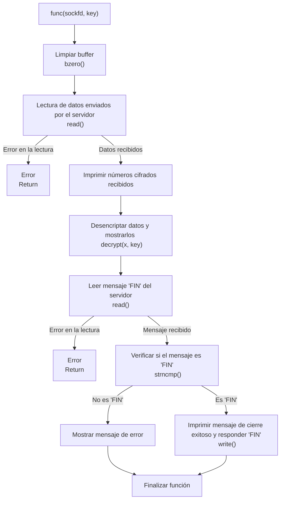

# Tcp-Client-Server-Network-Design
## Diseño de Infraestructura de Red y Comunicación Segura TCP


### Adriano Scatena

---

## Índice

- A. [Diseño de Infraestructura de Red (VLSM y Ruteo)](#diseño-de-infraestructura-de-red-vlsm-y-ruteo)
    1. [Contexto y Objetivos de Diseño](#contexto-y-objetivos-de-diseño)
    2. [Resolución y Criterios Técnicos](#resolución-y-criterios-técnicos)
    3. [Tablas de ruteo](#tablas-de-ruteo)
    4. [Implementación de NAT](#implementación-de-nat)

- B. [Arquitectura Cliente-Servidor TCP](#arquitectura-cliente-servidor-tcp) 
    1. [Objetivo del Sistema](#objetivo-del-sistema)
    2. [Resolución e Implementación](#resolución-e-implementación)
    3. [Servidor](#servidor)
    4. [Cliente](#cliente)
    5. [Análisis de tráfico de red](#análisis-de-tráfico-de-red)
    6. [Modo de uso](#modo-de-uso)

- C. [Bibliografía](#bibliografía)

---

# Diseño de Infraestructura de Red (VLSM y Ruteo)

## Contexto y Objetivos de Diseño

Se desarrolla una infraestructura de red completa partiendo del bloque:

```
181.29.188.0/22
```

El objetivo del diseño es:

- Implementar subnetting eficiente mediante VLSM.
- Asignar direccionamiento coherente a cada segmento.
- Configurar ruteo estático con caminos alternativos.
- Integrar una red privada mediante NAT.
- Garantizar conectividad total entre todos los segmentos e Internet.
- Considerar enlaces punto a punto y tolerancia ante fallas.

---

## Resolución y Criterios Técnicos

### Determinaciones iniciales

El bloque asignado es:

```
181.29.188.0/22
```

Representación binaria:

```
10110101.00011101.10111100.00000000
  181   .  29    .  188   .  0
```

El prefijo binario `10` indica que pertenece a **Clase B**, dentro del rango:

```
128.x.x.x – 191.x.x.x
```

Con máscara `/22` (255.255.252.0):

\[
2^{10} - 2 = 1022 \text{ hosts}
\]

Se restan 2 direcciones por red y broadcast.

---

### Subnetting VLSM

Se realizó un diseño de máscaras variables considerando:

- Cantidad de hosts requeridos.
- No solapamiento.
- Optimización del espacio disponible.

### Definición de cada Red propuesta

|  Redes  | Hosts requeridos |  Subred Asignada | Rango |
|:-------:|:-----:|:---------------:|:---------------:|
| Red A   |  230  | 181.29.188.0/24 | 181.29.188.0 - 181.29.188.255 |
| Red B   |  500  | 181.29.190.0/23 | 181.29.190.0 - 181.29.191.255 |
| Red C   |  40   | 181.29.189.0/26 | 181.29.189.0 - 181.29.189.63 |
| Red D   |  64   | 181.29.189.128/25 | 181.29.189.128 - 181.29.189.255 |

La Red E corresponde al bloque privado:

```
10.0.0.0/24
```

Rango reservado por RFC 1918 (Clase A).

---

### Asignación de Direcciones

<table>
  <tr>
    <th colspan="5" style="text-align: center;">Direcciones de los dispositivos</th>
  </tr>
  <tr>
    <th>Dispositivo</th>
    <th>Red</th>
    <th>Dirección designada</th>
  </tr>
  <tr>
    <td>n6</td>
    <td>Red A</td>
    <td>181.29.188.20/24</td>
  </tr>
  <tr>
    <td>n8</td>
    <td>Red B</td>
    <td>181.29.190.20/23</td>
  </tr>
  <tr>
    <td>n9</td>
    <td>Red C</td>
    <td>181.29.189.20/26</td>
  </tr>
  <tr>
    <td>n10</td>
    <td>Red D</td>
    <td>181.29.189.130/25</td>
  </tr>
  <tr>
    <td>n11</td>
    <td>Red E</td>
    <td>10.0.0.20/24</td>
  </tr>
</table>

---

### Enlaces Punto a Punto

Se implementaron subredes `/30` para interconexión entre routers.

| Router | Conexión con | Red Designada |
|--------|--------------|--------------|
| AEROESPACIAL | CENTRAL | 181.29.189.68/30 |
| AEROESPACIAL | HIDRÁULICA | 181.29.189.72/30 |
| HIDRÁULICA | CENTRAL | 181.29.189.76/30 |
| HIDRÁULICA | ELECTROTECNIA | 181.29.189.80/30 |
| ELECTROTECNIA | CENTRAL | 181.29.189.84/30 |
| ELECTROTECNIA | MECÁNICA | 181.29.189.88/30 |

---

## Tablas de Ruteo

Se destaca que el criterio de seleccion de metricas para otorgarle prioridad a ciertos caminos fue tomado en base a cual es el camino mas corto para llegar a destino. En caso de tener caminos de igual recorrido, se opta por seleccionar que los ruteos pasen por el Central preferentemente, como prioridad. 
A continuación, en las siguientes tablas puede observarse una representación del diseño de las tablas de ruteo para el bloque de red.

<table>
  <tr>
    <th colspan="5" style="text-align: center;">Router Hidráulica</th>
  </tr>
  <tr>
    <th>Destino</th>
    <th>Máscara</th>
    <th>Pasarela</th>
    <th>Métrica</th>
  </tr>
  <tr>
    <td>Red A</td>
    <td>/24</td>
    <td>Hidráulica</td>
    <td>0</td>
  </tr>
  <tr>
    <td>Red B</td>
    <td>/23</td>
    <td>Electrotecnia</td>
    <td>0</td>
  </tr>
    <tr>
    <td>Red B</td>
    <td>/23</td>
    <td>Central</td>
    <td>10</td>
  </tr>
    <tr>
    <td>Red B</td>
    <td>/23</td>
    <td>Aeroespacial</td>
    <td>20</td>
  </tr>
    <tr>
    <td>Red C</td>
    <td>/26</td>
    <td>Electrotecnia</td>
    <td>0</td>
  </tr>
    <tr>
    <td>Red C</td>
    <td>/26</td>
    <td>Central</td>
    <td>10</td>
  </tr>
    <tr>
    <td>Red C</td>
    <td>/26</td>
    <td>Aeroespacial</td>
    <td>20</td>
  </tr>
  <tr>
    <td>Red D</td>
    <td>/25</td>
    <td>Aeroespacial</td>
    <td>0</td>
  </tr>
    <tr>
    <td>Red D</td>
    <td>/25</td>
    <td>Central</td>
    <td>10</td>
  </tr>
    <tr>
    <td>Red D</td>
    <td>/25</td>
    <td>Electrotecnia</td>
    <td>20</td>
  </tr>
</table>
<table>
  <tr>
    <th colspan="5" style="text-align: center;">Router Aeroespacial</th>
  </tr>
  <tr>
    <th>Destino</th>
    <th>Máscara</th>
    <th>Pasarela</th>
    <th>Métrica</th>
  </tr>
  <tr>
    <td>Red A</td>
    <td>/24</td>
    <td>Hidráulica</td>
    <td>0</td>
  </tr>
    <tr>
    <td>Red A</td>
    <td>/24</td>
    <td>Central</td>
    <td>10</td>
  </tr>
    <tr>
    <td>Red B</td>
    <td>/23</td>
    <td>Central</td>
    <td>0</td>
  </tr>
  <tr>
    <td>Red B</td>
    <td>/23</td>
    <td>Hidráulica</td>
    <td>10</td>
  </tr>
    <tr>
    <td>Red C</td>
    <td>/26</td>
    <td>Central</td>
    <td>0</td>
  </tr>
    <tr>
    <td>Red C</td>
    <td>/26</td>
    <td>Hidráulica</td>
    <td>10</td>
  </tr>
  <tr>
    <td>Red D</td>
    <td>/25</td>
    <td>Aeroespacial</td>
    <td>0</td>
  </tr>
</table>

<table>
  <tr>
    <th colspan="5" style="text-align: center;">Router Electrotecnia</th>
  </tr>
  <tr>
    <th>Destino</th>
    <th>Máscara</th>
    <th>Pasarela</th>
    <th>Métrica</th>
  </tr>
  <tr>
    <td>Red A</td>
    <td>/24</td>
    <td>Hidráulica</td>
    <td>0</td>
  </tr>
  <tr>
    <td>Red A</td>
    <td>/24</td>
    <td>Central</td>
    <td>10</td>
  </tr>
    <tr>
    <td>Red B</td>
    <td>/23</td>
    <td>Aeroespacial</td>
    <td>0</td>
  </tr>
    <tr>
    <td>Red C</td>
    <td>/26</td>
    <td>Mecánica</td>
    <td>0</td>
  </tr>
  <tr>
    <td>Red D</td>
    <td>/25</td>
    <td>Central</td>
    <td>0</td>
  </tr>
    <tr>
    <td>Red D</td>
    <td>/25</td>
    <td>Hidráulica</td>
    <td>10</td>
  </tr>
</table>

<table>
  <tr>
    <th colspan="5" style="text-align: center;">Router Mecánica</th>
  </tr>
  <tr>
    <th>Destino</th>
    <th>Máscara</th>
    <th>Pasarela</th>
    <th>Métrica</th>
  </tr>
  <tr>
    <td>Red A</td>
    <td>/24</td>
    <td>Electrotecnia</td>
    <td>0</td>
  </tr>
    <tr>
    <td>Red B</td>
    <td>/23</td>
    <td>Electrotecnia</td>
    <td>0</td>
  </tr>
    <tr>
    <td>Red C</td>
    <td>/26</td>
    <td>Mecánica</td>
    <td>0</td>
  </tr>
    <tr>
    <td>Red D</td>
    <td>/25</td>
    <td>Electrotecnia</td>
    <td>0</td>
  </tr>
</table>

<table>
  <tr>
    <th colspan="5" style="text-align: center;">Router Central</th>
  </tr>
  <tr>
    <th>Destino</th>
    <th>Máscara</th>
    <th>Pasarela</th>
    <th>Métrica</th>
  </tr>
  <tr>
    <td>Red A</td>
    <td>/24</td>
    <td>Hidráulica</td>
    <td>0</td>
  </tr>
  <tr>
    <td>Red A</td>
    <td>/24</td>
    <td>Electrotecnia</td>
    <td>10</td>
  </tr>
    <tr>
    <td>Red A</td>
    <td>/24</td>
    <td>Aeroespacial</td>
    <td>20</td>
  </tr>
    <tr>
    <td>Red B</td>
    <td>/23</td>
    <td>Electrotecnia</td>
    <td>0</td>
  </tr>
    <tr>
    <td>Red B</td>
    <td>/23</td>
    <td>Hidráulica</td>
    <td>10</td>
  </tr>
    <tr>
    <td>Red B</td>
    <td>/23</td>
    <td>Aeroespacial</td>
    <td>20</td>
  </tr>
    <tr>
    <td>Red C</td>
    <td>/26</td>
    <td>Electrotecnia</td>
    <td>0</td>
  </tr>
  <tr>
    <td>Red C</td>
    <td>/26</td>
    <td>Hidráulica</td>
    <td>10</td>
  </tr>
    <tr>
    <td>Red C</td>
    <td>/26</td>
    <td>Aeroespacial</td>
    <td>20</td>
  </tr>
    <tr>
    <td>Red D</td>
    <td>/25</td>
    <td>Aeroespacial</td>
    <td>0</td>
  </tr>
    <tr>
    <td>Red D</td>
    <td>/25</td>
    <td>Hidráulica</td>
    <td>0</td>
  </tr>
    <tr>
    <td>Red D</td>
    <td>/25</td>
    <td>Electrotecnia</td>
    <td>10</td>
  </tr>
    <tr>
    <td>Red E</td>
    <td>/24</td>
    <td>Central</td>
    <td>0</td>
  </tr>
</table>

---

## Implementación de NAT

La traducción de direcciones (NAT) se implementa en el router **Central**, ya que es el punto de enlace entre:

- Red privada 10.0.0.0/24  
- Direcciones públicas  
- ISP  

Se utiliza `iptables` para realizar:

- Enmascaramiento dinámico.
- Registro en tabla NAT.
- Traducción bidireccional.

El servicio permite que múltiples hosts privados utilicen una única IP pública.

---

# Arquitectura Cliente-Servidor TCP

## Objetivo del Sistema

Se implementa una arquitectura TCP cliente-servidor en C que:

- Establece conexión confiable.
- Intercambia clave pública.
- Transmite datos cifrados.
- Finaliza ordenadamente la conexión.
- Permite análisis completo del tráfico capturado.

---

## Resolución e Implementación

Se desarrollan dos programas en C:

- `servidor.c`
- `cliente.c`

Utilizando:

```
<sys/socket.h>
<netinet/in.h>
<arpa/inet.h>
```

Se emplean estructuras `sockaddr_in`, y funciones:

- socket()
- bind()
- listen()
- accept()
- connect()
- send()
- recv()
- shutdown()
- close()

---

# Servidor

La implementación del servidor TCP diseñado tiene como objetivo recibir una clave pública desde un cliente, generar 20 números aleatorios, cifrarlos utilizando dicha clave, y enviarlos de vuelta al cliente. Dentro del proceso del mismo, se administra la creación del socket TCP, su correlación con una dirección IP y un puerto, y el procedimiento protocolar TCP de conexión con el cliente. También se administra la ordenada finalización de la conexión. En pos de conseguir un código más limpio, estrucuturado y fácil de interpretar, se estableció la rutina de configuración de conexión dentro del flujo principal, y el servicio específico dentro de una función declarada (`func()`) a la cual se la llama dentro de este flujo.

En el inicio, se declaran las variables y estructuras de control de conexión y de configuración del propio *server*, como el descriptor del socket `sockfd` y las estructuras del cliente y servidor definidas como `sockaddr_in`. Esta estructura tiene especial importancia ya que contiene los datos de funcionamiento del servidor:
```C
struct sockaddr_in {
    short sin_family; // Define la familia de direcciones IP a esperar, en caso IPv4 se usa AF_INET
    unsigned short sin_port; // Define el port (en orden de bytes de la red, por lo que se usa htons() para pasar de fomato de Host a formato de Red) 
    struct in_addr sin_addr; // Esta estructura define la direccion IP del socket (se escribe en 32 bits por o que se usa inet_aton() para conversión)
    char sin_zero[8]; // Definido pero no se usa
    };
```
Mediante la función `socket()` se crea el socket, explicitando `AF_INET` para familia de direcciones IPv4, `SOCK_STREAM` para indicar el uso de datos TCP, y el $0$ final indica al SO que seleccione el protocolo adecuado.
```C
  sockfd = socket(AF_INET, SOCK_STREAM, 0);
```
Luego se asigna tanto la IP como el puerto a utilizar por el servidor, completando los campos de la estructura antes mencionada. Se utiiza la bandera `INADDR_ANY` para que acepte conexiones en cualquier interfaz de red disponible.
```C
    servaddr.sin_family = AF_INET;  
    servaddr.sin_addr.s_addr = htonl(INADDR_ANY);  
    servaddr.sin_port = htons(PORT);  
```
Creado el socket TCP se lo asocia con los datos de la estructura, es decir la dirección IP y puerto especificados, mediante `bind()`. Como `bind()` se puede usar con otras familias, es necesario hacer una conversión de tipo (cast) entre `sockaddr_in` y `sockaddr`.
Posteriormente, se pasa el socket a un estado de apertura pasiva con `listen()`, donde espera por conexiones entrantes. Una vez que un cliente se conecta, la función `accept()` establece la conexión y permite el intercambio de datos.

El flujo del servicio comienza con el servidor recibiendo la clave pública del cliente, la cual se procesa y almacena para usar en el cifrado. Esto se hace mediante la función `recv()`, la cual lee los datos del descriptor de archivos *connected* del socket, y los almacena dentro de `buffer`, que es un arreglo de caractéres. A continuación, el servidor genera 20 números aleatorios entre 0 y 26, los cifra con una operación modular (especificada en la función de usuario `encrypt()`), basada en la clave pública recibida, y los almacena en un arreglo. Este arreglo cifrado es enviado al cliente mediante la función `send()`, la cual a la inversa de `recv()`, copia lo almacenado en el *buffer* de datos encriptados (en este caso `num_array`) en el descriptor del socket. Finalmente, el servidor envía la flag de cierre (*FIN*) al cliente, utilizando al función `shutdown()`, cerrando el descriptor para la escritura y lectura de datos con la bandera `SHUT_WR`, y cierra la conexión de manera ordenada usando `close()`.

Cabe destacar que se implementó un manejo básico de errores con tal de asegurar que el servidor informe ante fallos comunes como problemas al crear el socket, errores de enlace o fallas de comunicación.

---

### Diagramas de flujo


Para especificar su funcionamiento, se adjunta a continuación el diagrama de flujo de la función que realiza el servicio propiamente dicho.

---

# Cliente

Para el cliente, se generó un script en C que se encarga de describir el funcionamiento del mismo, con el objetivo de que el cliente se conecte al servidor implementado, acudiendo a establecer una conexión TCP para recibir y desencriptar el paquete de números enviados de manera cifrada por el servidor. Previamente a la recepción de los datos, el cliente informa la clave pública mediante la cual serán encriptados los datos por el servidor. Nuevamente se estrucutura la rutina de configuración de conexión dentro del flujo principal, y comportamiento específico del cliente dentro de (`func()`) a la cual se la llama dentro del flujo principal.
Respetando los requisitos de la consigna, en primer lugar, el cliente solicita al usuario la IP y el puerto del servidor al que desea conectarse. Luego, se procede a crear un socket TCP de manera totalmente análga a como se realiza en el servidor, usando `socket()`, explicitand el protocolo `AF_INET` para IPv4 y el tipo `SOCK_STREAM` para establecer una conexión orientada a TCP. Tras crear el socket, se repite el mismo proceso que en la contraparte, donde se configura la dirección del servidor (utlizando la IP y el puerto provistos por el usuario) usando la estructura `sockaddr_in` ya comentada. Para la conexión con el servidor se reutiliza la función `connect()`. Una vez exitosa la conexión, el cliente comunica en formato de cadena la clave pública mediante el uso de `send()` y el descriptor de archivos del socket (`sockfd`).

Posteriormente, el cliente entra en su función específica, en donde recibe el arreglo de 20 números cifrados enviados por el servidor a través del uso de `recv()` y `sockfd`, copiando lo recibido en `buffer`. Estos datos deben ser desencriptados, y se hace usando una función de desencriptación (`decrypt()`), que aplica módulo 100 a la operación $x - clave +100$, donde $x$ es el dato a desencriptar. Tanto los números cifrados como los resultantes de la desencriptación se imprimen en la terminal a modo de control. Toda esta dinámica está implementada dentro de un bucle que controla lo devuelto por `recv()`, ya que se espera qe el servidor enví la flag *FIN* respectiva para el cierre de la conexión, siendo 0 el valor de retorno cuando `recv()` recibe dicho paquete. Ya recibidos los datos, el cliente debe manejar el cierre de la comunicación. Después de recibir el mensaje *FIN* del servidor, el cliente responde enviando *FIN* de vuelta al servidor (dinámica ya incuida en el propio protocolo TCP), lo que indica el cierre de la conexión. Finalmente, el socket se cierra con la función `close()`.

---

### Diagramas de flujo




---

# Análisis de tráfico de Red

### Análisis de la Conexión TCP entre el Cliente y el Servidor

Se realiza la captura de datos de la conexión TCP entre el servidor 181.29.189.130 (perteneciente a la subred D) y el cliente 181.29.189.20 (perteneciente a la subred C). A continuación, se pueden observar los diferentes paquetes que se intercambiaron durante el establecimiento de la conexión, la transmisión de datos y la terminación de la conexión. El de inicio de la conexión TCP comienza con el *three-way handshake* (caracteristica del protocolo TCP), que permite una comunicación confiable (a diferencia de UDP), asegurando que ambas máquinas estén sincronizadas antes de empezar a compartir información. Véase la siguiente figura con el tráfico de datos TCP capturado.


A modo de argumentar los envíos de flags de control vistos en el tráfico de red, me basé en los esquemas de *3-way handshake* y *4-way handshake*, vistos respectivamente a continuación.


---

# Modo de uso

Para hacer uso y depurar/comprobar la funcionalidad del cliente y servidor implementados, debe seguirse los siguientes pasos.
Inicialmente debe abrirse la topología implementada en `topology.imn` en el software ***CORE Network Emulator***, de manera que pueda posteriormente iniciarse la sesión de red donde se trabajará con las entidades implementadas. Previamente o en la propia consola del sistema a tomar como servidor (o cliente), debe compilarse el script en lenguaje C a accionar. Esto puede hacerse via consola con el comando:
```bash
  gcc <archivo.c> -o <archivo_ejecutable>
```
Esto debe realizarse tanto para el script `cliente.c` como `servidor.c`, de lo contrario no podran ejecutarse.
Una vez compilado, se debe ingresar a la consola del sistema al que se quiere accionar como servidor y ejecutar en él el archivo ejecutable compilado previamente. Es importante primero ejecutar el servidor en un sistema y luego el cliente, de lo contrario no se establecerá conexión alguna. La ejecución en terminal se realiza como:
```bash
  ./<archivo_ejecutable>
```
Es de utilidad el comando `cd` para poder cambiar de directorio a donde se haya ubicado los archivos ejecutables.
Una vez ejecutado, en el servidor, se informará la correcta conexión o agún error en la misma en caso que corresponda, y solo se procederá al servicio si se conecta un cliente. En el caso del cliente, ejecutado el programa deberá informarse el número de puerto y la dirección IP del servidor, información accesible tanto en la topología de CORE (en caso de la IP), como en la terminal del servidor (en caso del puerto). Proporcionado los datos se podrá observar la funcionalidad del esquema cliente-servidor reaizado.

---

# Bibliografía
1. ["Manual de sockets en C.", Universidad de Cantabria.](https://ocw.unican.es/pluginfile.php/2343/course/section/2300/PIR-Practica4_ManualSocketsC.pdf) Consultado en línea 2024-12-05.

2. ["TCP Server-Client implementation in C."](https://www.geeksforgeeks.org/tcp-server-client-implementation-in-c/) Consultado en línea 2024-12-05.

3. ["Manual de la función recv()"](https://linux.die.net/man/2/recv) 

4. ["Manual de la función send()"](https://linux.die.net/man/2/send)
 
